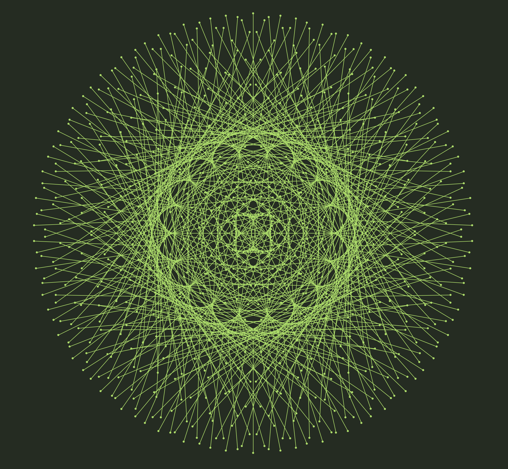
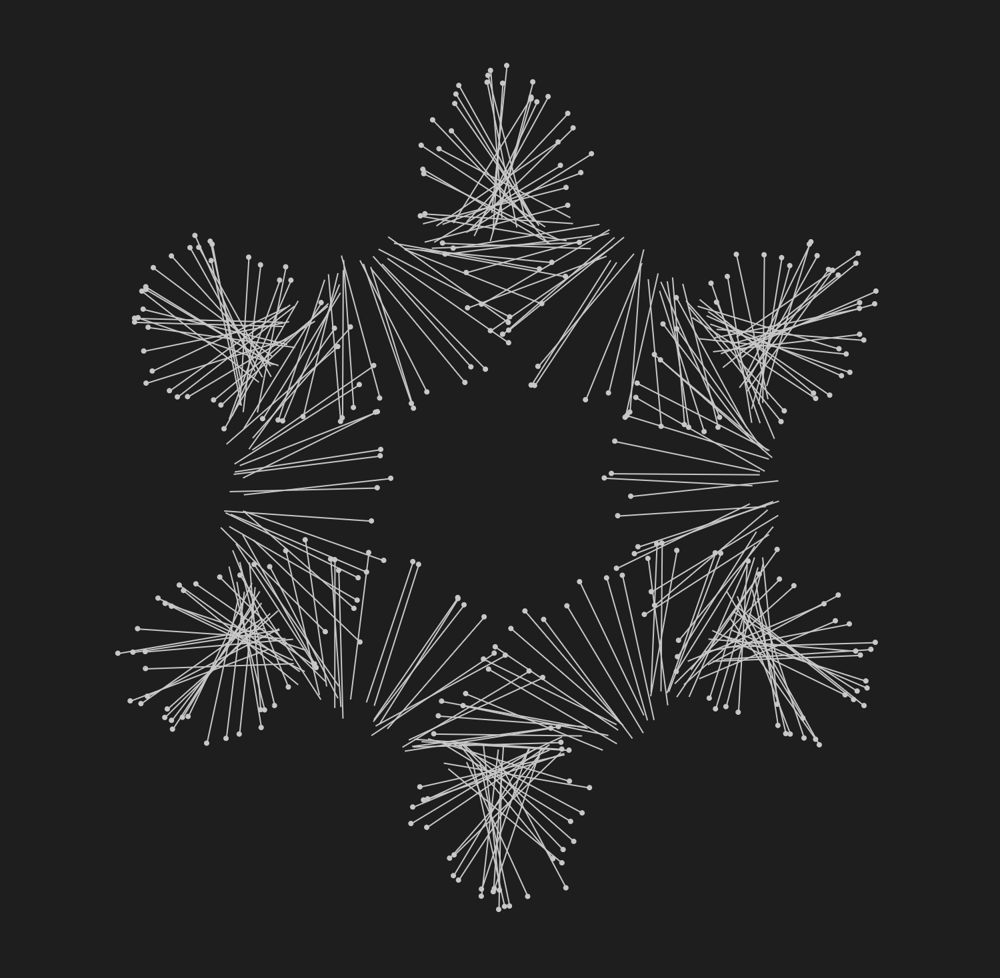

# M-circle

A visual experiment

- The why: I wanted to try out [the P5.js library](https://p5js.org/) and play around, making something visual, just for fun.
- The starting point: on an imaginary circle, draw a series of lines. Let each line rotate a little bit compared to the previous one. Play with different variables.
- The result: an interactive drawing that can be modified by the user, and has the potential to result in fascinating shapes.

[Try it online here](https://sambody.github.io/p5js-circle/). Have fun.

I call it M-circle. The M stands for Muybridge: he was a photographer famous for series of images that decompose a movement into separate photographs. The lines on the circle are a bit like that, steps of a movement.

Some examples:

